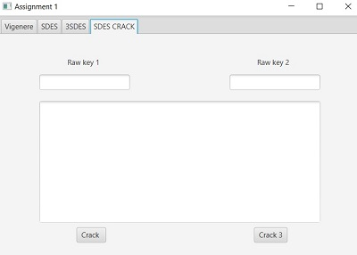

# Dat510 Assignment

A simple cryptology Java project with an JavaFx interface which implement Vigenere, SDES and TripleSDES.
It was made with Intellij IDEA

# Requirements
Need Java 9 or higher to be run because of JavaFx.

# Structure
```
├── src
   └── sample
      ├── Controller.java  Contains all the methods triggered by the interface      
      ├── Main.java        Java class to run      
      ├── sample.fxml      fxml file which define the interface      
      ├── SDES.java        Java class where the SDES logic is      
      ├── ThreeSDES.java   Java class where the ThreeSDES logic is      
      └── Vigenere.java    Java class where the Vigenere logic is      
 ```
# Screens



